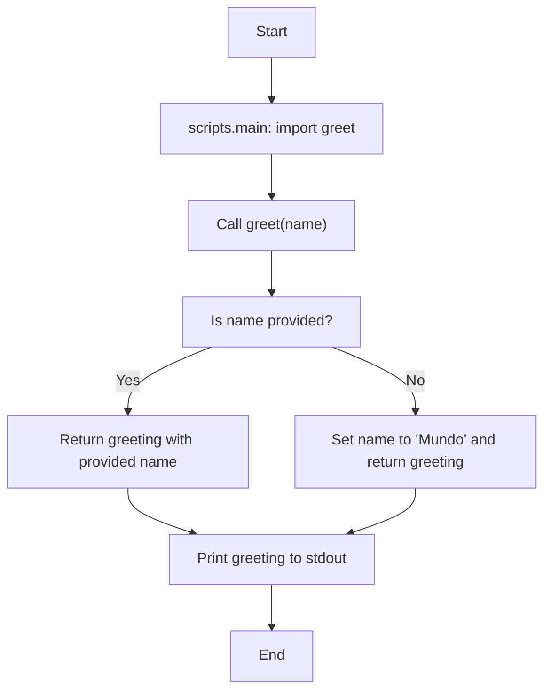

# holamundo

Project documentation for the sample Python scripts contained in the repository. The purpose of this document is to describe the project structure, to explain the behavior of each script at the function level, and to illustrate the runtime flow with a Mermaid diagram.

1. Overview

1.1 Purpose

This repository contains a minimal Python sample intended for testing documentation workflows. It provides a small entry point and a helper module that demonstrates idiomatic docstrings suitable for automatic documentation generation.

1.2 Scope

The documentation focuses on the files within the `scripts` directory and the `docs` directory that contains example output. No external dependencies are required to run the sample scripts.

2. Repository structure

1. `scripts/` Contains executable modules used by the sample application.
2. `docs/` Contains example documentation artifacts and markdown that illustrate how docstrings can be rendered.
3. `.github/copilot-instructions.md` Contains guidance for AI coding agents tailored to this repository.

3. Execution and verification

To run the entry point module as a script, execute the following commands from the repository root.

```bash
python -m scripts.main
python scripts/hello.py Ana
```

4. Module: scripts.hello

4.1 Purpose

This module implements utility functions used by the sample application. The primary exported function is `greet`.

4.2 Function: greet

Function signature

```python
def greet(name: Optional[str] = None) -> str:
```

Behavior and step by step

1. Accepts an optional `name` parameter. If `name` is None or empty, the function substitutes a default value of "Mundo".
2. Constructs a greeting string in Spanish using the resolved name.
3. Returns the greeting string.

Examples

1. Python API usage

```python
from scripts.hello import greet

print(greet('Ana'))
print(greet())
```

1. Command line usage

```bash
python scripts/hello.py Ana
```

Notes for contributors

1. Docstring style follows a concise Google style that includes a brief description, an Args section, and a Returns section. Use a similar structure for new public functions.

5. Module: scripts.main

5.1 Purpose

This module provides a minimal entry point for the sample application. Its role is to import the primary helper function and expose a runnable script for quick verification.

5.2 Behavior and step by step

1. Import the `greet` function from `scripts.hello`.
2. Call `greet` with the default example name "Mundo".
3. Print the returned greeting to standard output.

6. Runtime flow diagram

The following Mermaid diagram shows the call flow from the entry point to the helper function and the branches that depend on whether a name value is provided.



7. Documentation generation notes

1. The repository is intentionally dependency free. If a documentation generator is required, recommend the following options and document the added dependency before installation.
2. Place generated documentation artifacts in the `docs` directory.

8. Contribution guidance for AI agents

1. Preserve the small repository layout. Do not add new top-level packages or change the directory structure without express approval.
2. When adding or modifying functions in `scripts/`, include a proper docstring following the `greet` example so automated tools can extract documentation reliably.
3. Prefer modifications that keep `scripts/main.py` as a minimal runner. Complex test harnesses or additional CLI parsing should be introduced in separate modules when necessary.

9. Contact and next steps

If further examples are required, confirm whether to add a Sphinx or mkdocs template and whether to include a small script to produce HTML documentation from `scripts/` docstrings.
